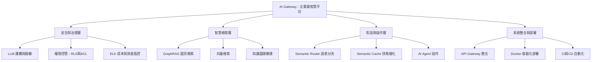
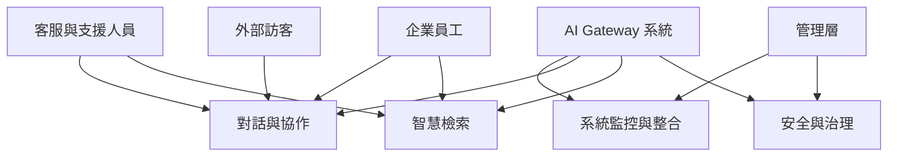

# HW3：系統需求文件（System Requirements）

## 功能性需求（Functional Requirements）

### 1. 用戶與權限管理
- 系統必須支援使用者登入、註冊與多角色權限控管（一般員工、主管、管理員等）。
- 系統應於知識圖譜的節點與邊上保存權限標籤（RLS/ACL）。
- 查詢前必須執行授權檢查（AuthZ Pre-check），確保使用者僅能存取符合權限的資訊。
- 所有輸入資料須經 LLM 護欄與 NER 脫敏處理，防止敏感資訊外洩。

### 2. 智慧檢索（GraphRAG + 向量檢索）
- 系統必須支援語意相似度搜尋、跨文件檢索與多跳推理。
- 文件須轉換為「知識圖譜 + 向量嵌入」，以保留跨欄位與跨文件關聯。
- 查詢時同時執行向量檢索與圖譜檢索，生成完整而非片段化回答。
- 系統應提供 API 介面以供外部系統（ERP、CRM）調用查詢。

### 3. 對話與語意路由（Semantic Router + Cache）
- 系統應具備語意分流能力，能根據問題內容自動選擇最適模組（LLM、外部工具或檢索引擎）。
- 整合 Semantic Cache 快取模組，當相似問題再次出現時可直接回覆。
- 若查詢超出知識範圍，應交由 AI Agent 處理並更新知識庫。
- 支援 A2A（Agent-to-Agent）與 MCP（Model Context Protocol）協作機制。

### 4. 系統治理與可觀測性
- 系統須整合 ELK 報表監控（Elasticsearch、Logstash、Kibana）。
- 應能追蹤模型運算成本、請求來源、查詢類型及使用量。
- 管理者可透過統一 API Gateway 查詢系統負載、快取命中率與延遲。

### 5. 成本管理與最佳化
- 系統必須提供成本追蹤模組，統計各模型與請求的花費。
- 快取命中後應自動略過重複生成，降低 API 成本。
- 系統應支援負載平衡（Load Balancing）以分配運算資源。

### 6. 部署與整合
- 系統應支援容器化（Docker / Docker Compose）。
- 統一 API Gateway 必須支援多模型整合與動態擴充。
- 系統須能與 ERP、CRM、文件庫、Slack、Teams、LINE 等服務整合。
- 提供 CI/CD 流程（GitHub/GitLab）以支援自動化部署。

---

## 非功能性需求（Non-Functional Requirements）

### 1. 效能（Performance）
- 系統應於 **3 秒內**完成頁面載入。
- 平均查詢回應時間應小於 **2 秒**。
- 支援至少 **500 位同時使用者**。
- Semantic Cache 命中率應達 **60% 以上**。

### 2. 安全性（Security）
- 所有密碼與敏感資料需使用 **SHA-256 或以上演算法**加密。
- 系統傳輸採用 **HTTPS / TLS 1.3**。
- 輸入與輸出階段必須通過 LLM Guardrails 與脫敏檢查。
- 防範 SQL Injection、XSS、CSRF 與 Prompt Injection 攻擊。
- 權限驗證流程符合 RLS/ACL 架構。

### 3. 可用性（Availability）
- 系統應保持 **99.9% 運行時間（Uptime）**。
- 支援 Chrome、Firefox、Edge、Safari 等主流瀏覽器。
- 介面設計應符合 **WCAG 2.1 AA 無障礙標準**。

### 4. 可擴展性（Scalability）
- 架構應支援 **水平擴展（Horizontal Scaling）**。
- 資料庫設計可支援 **10 年以上**資料成長。
- 支援外部大模型 API（Azure OpenAI、DeepSeek）與本地模型。

### 5. 可維護性（Maintainability）
- 程式碼遵循 **PEP8 / Google Python Style Guide**。
- 系統應提供詳細的錯誤與操作日誌。
- 支援 **熱更新（Hot Reload）**，不中斷服務進行小規模升級。
- 所有開發與 API 文件應與版本控制同步。

# 🧭 功能分解圖（Functional Decomposition Diagram, FDD）

# 🎯 系統使用案例圖（Use Case Diagram）

# 使用案例說明（Use Case Specification）

---

## 使用案例名稱：內部知識查詢

| 欄位 | 說明 |
|------|------|
| **行動者** | 企業內部員工 |
| **說明** | 員工輸入問題，系統根據權限與知識圖譜進行檢索，回傳安全且精準的回答。 |
| **完成動作** | 1. 員工於對話介面輸入查詢問題。 2. 系統執行 LLM 護欄與 NER 脫敏。 3. 系統根據權限標籤（RLS/ACL）執行授權檢查。 4. 系統透過 GraphRAG + 向量檢索獲取相關內容。 5. 回傳可見範圍內的答案至使用者端。 |
| **替代方法** | 1. 若查詢內容超出權限，系統回傳「無存取權限」提示。 2. 若知識庫中無對應資料，系統轉交給 AI Agent 進行推理或標記為未知。 |
| **先決條件** | 使用者已登入系統並具備查詢權限。 |
| **後置條件** | 系統記錄查詢紀錄與回覆內容，用於快取與成本分析。 |
| **假設** | 系統知識庫已完成資料前處理與權限標籤設定。 |

---

## 使用案例名稱：語意路由與快取命中

| 欄位 | 說明 |
|------|------|
| **行動者** | 系統使用者（可為員工或客服人員） |
| **說明** | 使用者提出查詢後，系統透過 Semantic Router 自動選擇處理模組，若命中快取則直接回覆結果。 |
| **完成動作** | 1. 使用者發出查詢請求。 2. 系統分析語意並透過 Semantic Router 判斷最佳路由。 3. 若相似問題已存在於 Semantic Cache，直接回覆快取結果。 4. 若無快取，則轉交相應模組（LLM、RAG、外部工具）處理後回覆。 5. 將結果存入快取以供後續命中使用。 |
| **替代方法** | 1. 若路由判斷失敗，系統以預設 LLM 模型處理。 2. 若快取命中但資料過期，系統自動重查並更新快取內容。 |
| **先決條件** | 系統內部已啟用 Semantic Router 與 Cache 模組。 |
| **後置條件** | 快取資料更新，並記錄查詢次數與處理時間以供分析。 |
| **假設** | 快取命中率與權限驗證邏輯皆設定正確。 |

---

## 使用案例名稱：系統監控與成本追蹤

| 欄位 | 說明 |
|------|------|
| **行動者** | 系統管理員 |
| **說明** | 管理員透過 ELK 報表與統一 API 監控系統效能與成本，進行資源優化。 |
| **完成動作** | 1. 管理員登入管理介面。 2. 系統顯示模型使用量、API 請求次數與成本報表。 3. 管理員可根據統計結果調整模型權重或資源配置。 4. 當系統發現異常流量或成本異常時，觸發警示通知。 |
| **替代方法** | 1. 若 ELK 報表異常，系統自動啟用備援記錄模組。 2. 若 API Gateway 資料延遲，系統提供手動同步選項。 |
| **先決條件** | 系統已啟用 ELK Stack 並與 API Gateway 整合。 |
| **後置條件** | 系統生成最新的效能與成本紀錄報表。 |
| **假設** | 所有子系統皆正常回傳監控資料。 |
