# HW3：系統需求文件（System Requirements）

## 功能性需求（Functional Requirements）

### 1. 用戶與權限管理
- 系統必須支援使用者登入、註冊與多角色權限控管（一般員工、主管、管理員等）。
- 系統應於知識圖譜的節點與邊上保存權限標籤（RLS/ACL）。
- 查詢前必須執行授權檢查（AuthZ Pre-check），確保使用者僅能存取符合權限的資訊。
- 所有輸入資料須經 LLM 護欄與 NER 脫敏處理，防止敏感資訊外洩。

### 2. 智慧檢索（GraphRAG + 向量檢索）
- 系統必須支援語意相似度搜尋、跨文件檢索與多跳推理。
- 文件須轉換為「知識圖譜 + 向量嵌入」，以保留跨欄位與跨文件關聯。
- 查詢時同時執行向量檢索與圖譜檢索，生成完整而非片段化回答。
- 系統應提供 API 介面以供外部系統（ERP、CRM）調用查詢。

### 3. 對話與語意路由（Semantic Router + Cache）
- 系統應具備語意分流能力，能根據問題內容自動選擇最適模組（LLM、外部工具或檢索引擎）。
- 整合 Semantic Cache 快取模組，當相似問題再次出現時可直接回覆。
- 若查詢超出知識範圍，應交由 AI Agent 處理並更新知識庫。
- 支援 A2A（Agent-to-Agent）與 MCP（Model Context Protocol）協作機制。

### 4. 系統治理與可觀測性
- 系統須整合 ELK 報表監控（Elasticsearch、Logstash、Kibana）。
- 應能追蹤模型運算成本、請求來源、查詢類型及使用量。
- 管理者可透過統一 API Gateway 查詢系統負載、快取命中率與延遲。

### 5. 成本管理與最佳化
- 系統必須提供成本追蹤模組，統計各模型與請求的花費。
- 快取命中後應自動略過重複生成，降低 API 成本。
- 系統應支援負載平衡（Load Balancing）以分配運算資源。

### 6. 部署與整合
- 系統應支援容器化（Docker / Docker Compose）。
- 統一 API Gateway 必須支援多模型整合與動態擴充。
- 系統須能與 ERP、CRM、文件庫、Slack、Teams、LINE 等服務整合。
- 提供 CI/CD 流程（GitHub/GitLab）以支援自動化部署。

---

## 非功能性需求（Non-Functional Requirements）

### 1. 效能（Performance）
- 系統應於 **3 秒內**完成頁面載入。
- 平均查詢回應時間應小於 **2 秒**。
- 支援至少 **500 位同時使用者**。
- Semantic Cache 命中率應達 **60% 以上**。

### 2. 安全性（Security）
- 所有密碼與敏感資料需使用 **SHA-256 或以上演算法**加密。
- 系統傳輸採用 **HTTPS / TLS 1.3**。
- 輸入與輸出階段必須通過 LLM Guardrails 與脫敏檢查。
- 防範 SQL Injection、XSS、CSRF 與 Prompt Injection 攻擊。
- 權限驗證流程符合 RLS/ACL 架構。

### 3. 可用性（Availability）
- 系統應保持 **99.9% 運行時間（Uptime）**。
- 支援 Chrome、Firefox、Edge、Safari 等主流瀏覽器。
- 介面設計應符合 **WCAG 2.1 AA 無障礙標準**。

### 4. 可擴展性（Scalability）
- 架構應支援 **水平擴展（Horizontal Scaling）**。
- 資料庫設計可支援 **10 年以上**資料成長。
- 支援外部大模型 API（Azure OpenAI、DeepSeek）與本地模型。

### 5. 可維護性（Maintainability）
- 程式碼遵循 **PEP8 / Google Python Style Guide**。
- 系統應提供詳細的錯誤與操作日誌。
- 支援 **熱更新（Hot Reload）**，不中斷服務進行小規模升級。
- 所有開發與 API 文件應與版本控制同步。


# 🧭 功能分解圖（Functional Decomposition Diagram, FDD）

```mermaid
graph TD
    A[AI Gateway：企業級智慧平台]

    %% 第一層
    A --> B1[安全與治理層]
    A --> B2[智慧檢索層]
    A --> B3[對話與協作層]
    A --> B4[系統整合與部署]

    %% 安全與治理層
    B1 --> C1[LLM 護欄與脫敏]
    B1 --> C2[權限控管 - RLS與ACL]
    B1 --> C3[ELK 成本與效能監控]

    %% 智慧檢索層
    B2 --> D1[GraphRAG 圖形檢索]
    B2 --> D2[向量檢索]
    B2 --> D3[知識圖譜構建]

    %% 對話與協作層
    B3 --> E1[Semantic Router 語意分流]
    B3 --> E2[Semantic Cache 快取優化]
    B3 --> E3[AI Agent 協作]

    %% 系統整合與部署
    B4 --> F1[API Gateway 整合]
    B4 --> F2[Docker 容器化部署]
    B4 --> F3[CI與CD 自動化]
```




# 🎯 系統使用案例圖（Use Case Diagram）

```mermaid
graph TD
    %% 使用者角色
    U1[企業員工]
    U2[客服與支援人員]
    U3[管理層]
    U4[外部訪客]

    %% 系統主體
    S[AI Gateway 系統]

    %% 核心功能
    S --> F1[安全與治理]
    S --> F2[智慧檢索]
    S --> F3[對話與協作]
    S --> F4[系統監控與整合]

    %% 關聯線條
    U1 --> F2
    U1 --> F3

    U2 --> F2
    U2 --> F3

    U3 --> F1
    U3 --> F4

    U4 --> F3


