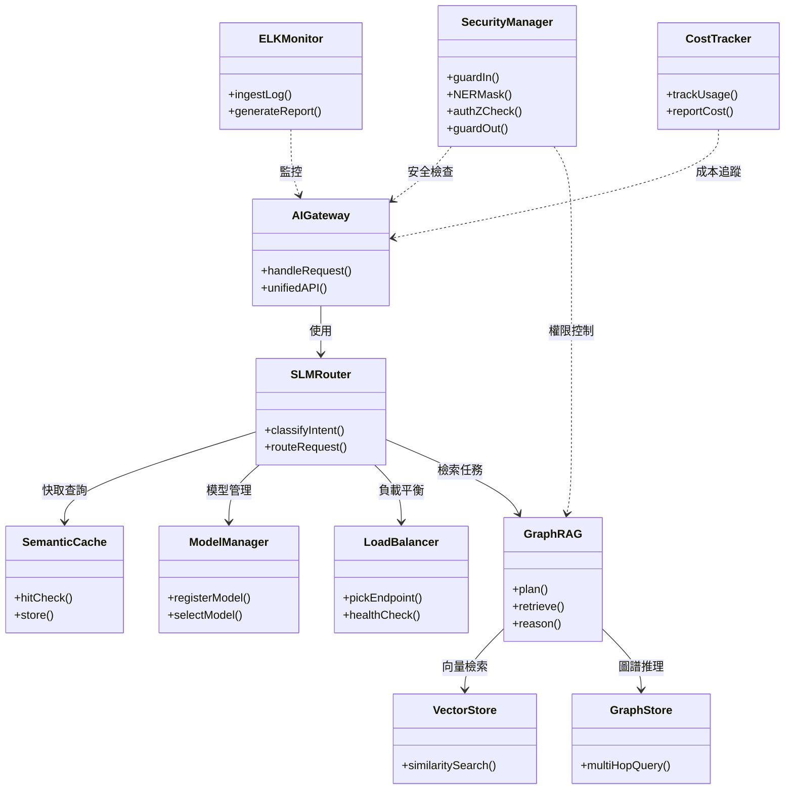
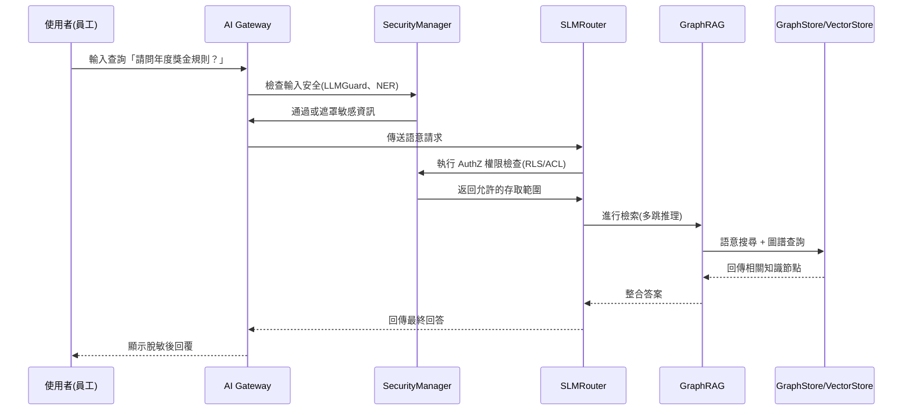
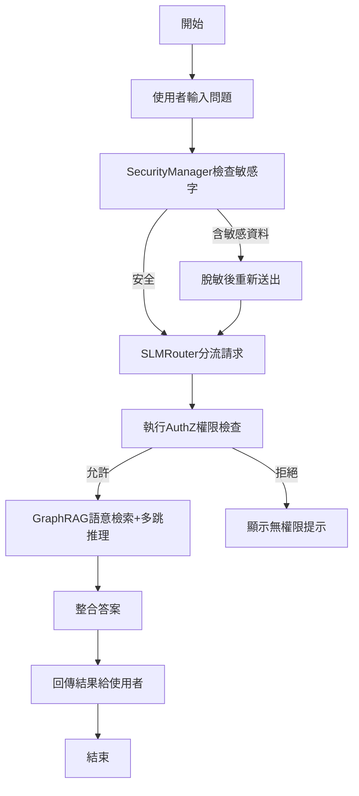
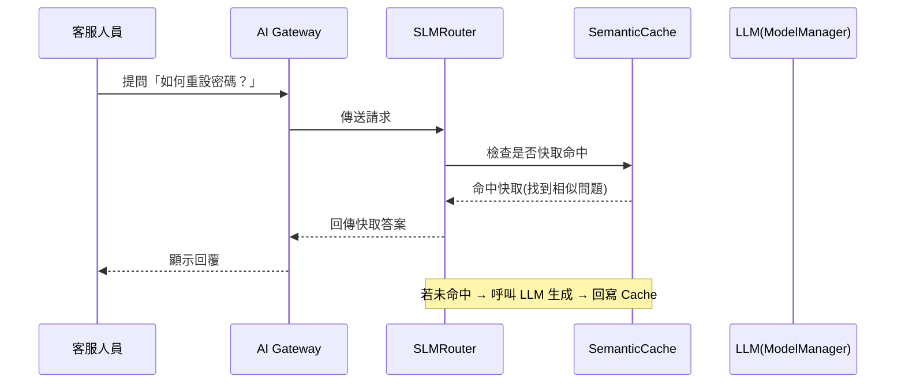
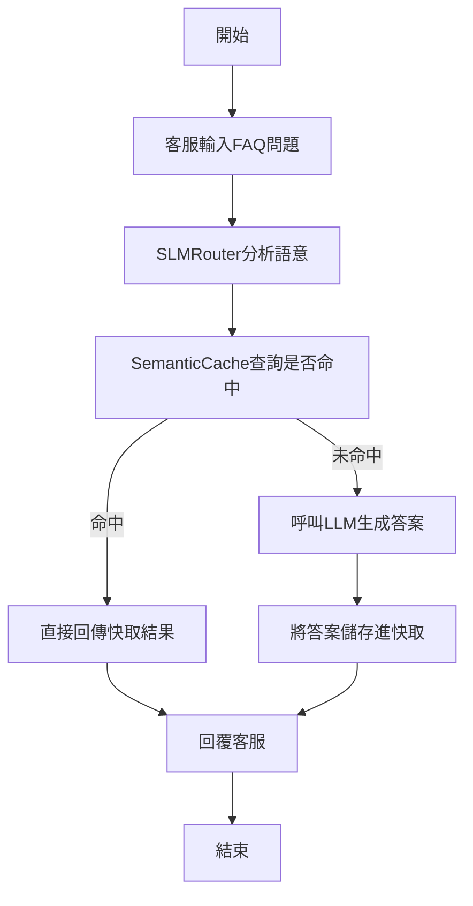
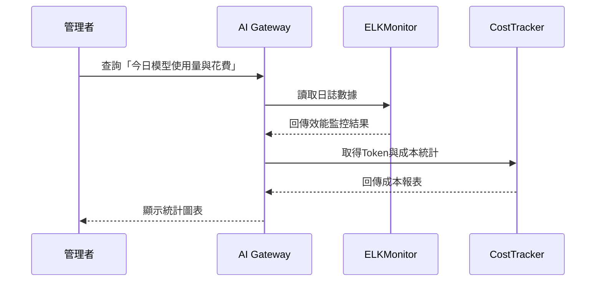
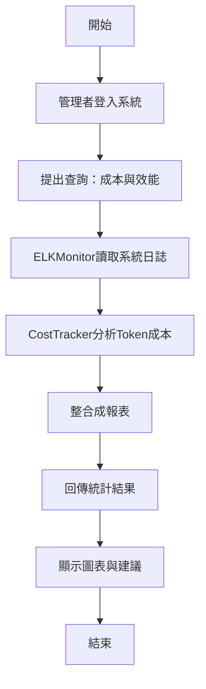

一. UML類別圖(Class Diagram)

```mermaid
classDiagram
    direction TB

    %% === 安全與治理層 ===
    class SecurityManager {
        +guardIn()
        +NERMask()
        +authZCheck()
        +guardOut()
    }

    class ELKMonitor {
        +ingestLog()
        +generateReport()
    }

    class CostTracker {
        +trackUsage()
        +reportCost()
    }

    %% === 對話協作層 ===
    class AIGateway {
        +handleRequest()
        +unifiedAPI()
    }

    class SLMRouter {
        +classifyIntent()
        +routeRequest()
    }

    class ModelManager {
        +registerModel()
        +selectModel()
    }

    class LoadBalancer {
        +pickEndpoint()
        +healthCheck()
    }

    class SemanticCache {
        +hitCheck()
        +store()
    }

    %% === 智慧檢索層 ===
    class GraphRAG {
        +plan()
        +retrieve()
        +reason()
    }

    class VectorStore {
        +similaritySearch()
    }

    class GraphStore {
        +multiHopQuery()
    }

    %% === 關聯層次 ===
    AIGateway --> SLMRouter : 使用
    SLMRouter --> SemanticCache : 快取查詢
    SLMRouter --> ModelManager : 模型管理
    SLMRouter --> LoadBalancer : 負載平衡
    SLMRouter --> GraphRAG : 檢索任務
    GraphRAG --> VectorStore : 向量檢索
    GraphRAG --> GraphStore : 圖譜推理

    %% === 跨層治理 ===
    SecurityManager ..> AIGateway : 安全檢查
    SecurityManager ..> GraphRAG : 權限控制
    ELKMonitor ..> AIGateway : 監控
    CostTracker ..> AIGateway : 成本追蹤
```
二.使用情境: \
1.使用案例一：企業員工查詢內部知識文件（RLS/ACL 控管）\
循序圖:

```mermaid
sequenceDiagram
    participant User as 使用者(員工)
    participant Gateway as AI Gateway
    participant Security as SecurityManager
    participant Router as SLMRouter
    participant RAG as GraphRAG
    participant DB as GraphStore/VectorStore

    User ->> Gateway: 輸入查詢「請問年度獎金規則？」
    Gateway ->> Security: 檢查輸入安全(LLMGuard、NER)
    Security ->> Gateway: 通過或遮罩敏感資訊
    Gateway ->> Router: 傳送語意請求
    Router ->> Security: 執行 AuthZ 權限檢查(RLS/ACL)
    Security ->> Router: 返回允許的存取範圍
    Router ->> RAG: 進行檢索(多跳推理)
    RAG ->> DB: 語意搜尋 + 圖譜查詢
    DB -->> RAG: 回傳相關知識節點
    RAG -->> Router: 整合答案
    Router -->> Gateway: 回傳最終回答
    Gateway -->> User: 顯示脫敏後回覆
```
活動圖:

```mermaid
flowchart TD
    A[開始] --> B[使用者輸入問題]
    B --> C[SecurityManager檢查敏感字]
    C -->|安全| D[SLMRouter分流請求]
    C -->|含敏感資料| B1[脫敏後重新送出] --> D
    D --> E[執行AuthZ權限檢查]
    E -->|允許| F[GraphRAG語意檢索+多跳推理]
    E -->|拒絕| G[顯示無權限提示]
    F --> H[整合答案]
    H --> I[回傳結果給使用者]
    I --> J[結束]
```
2.使用案例二：客服人員進行 FAQ 智慧回覆 \
循序圖:

```mermaid
sequenceDiagram
    participant CSR as 客服人員
    participant Gateway as AI Gateway
    participant Router as SLMRouter
    participant Cache as SemanticCache
    participant LLM as LLM(ModelManager)

    CSR ->> Gateway: 提問「如何重設密碼？」
    Gateway ->> Router: 傳送請求
    Router ->> Cache: 檢查是否快取命中
    Cache -->> Router: 命中快取(找到相似問題)
    Router -->> Gateway: 回傳快取答案
    Gateway -->> CSR: 顯示回覆

    Note over Router,Cache: 若未命中 → 呼叫 LLM 生成 → 回寫 Cache
```
活動圖:

```mermaid
flowchart TD
    A[開始] --> B[客服輸入FAQ問題]
    B --> C[SLMRouter分析語意]
    C --> D[SemanticCache查詢是否命中]
    D -->|命中| E[直接回傳快取結果]
    D -->|未命中| F[呼叫LLM生成答案]
    F --> G[將答案儲存進快取]
    E --> H[回覆客服]
    G --> H
    H --> I[結束]
```
3.使用案例三：管理者監控系統成本與效能\
循序圖:

```mermaid
sequenceDiagram
    participant Admin as 管理者
    participant Gateway as AI Gateway
    participant ELK as ELKMonitor
    participant Cost as CostTracker

    Admin ->> Gateway: 查詢「今日模型使用量與花費」
    Gateway ->> ELK: 讀取日誌數據
    ELK -->> Gateway: 回傳效能監控結果
    Gateway ->> Cost: 取得Token與成本統計
    Cost -->> Gateway: 回傳成本報表
    Gateway -->> Admin: 顯示統計圖表
```
活動圖:

```mermaid
flowchart TD
    A[開始] --> B[管理者登入系統]
    B --> C[提出查詢：成本與效能]
    C --> D[ELKMonitor讀取系統日誌]
    D --> E[CostTracker分析Token成本]
    E --> F[整合成報表]
    F --> G[回傳統計結果]
    G --> H[顯示圖表與建議]
    H --> I[結束]
```
