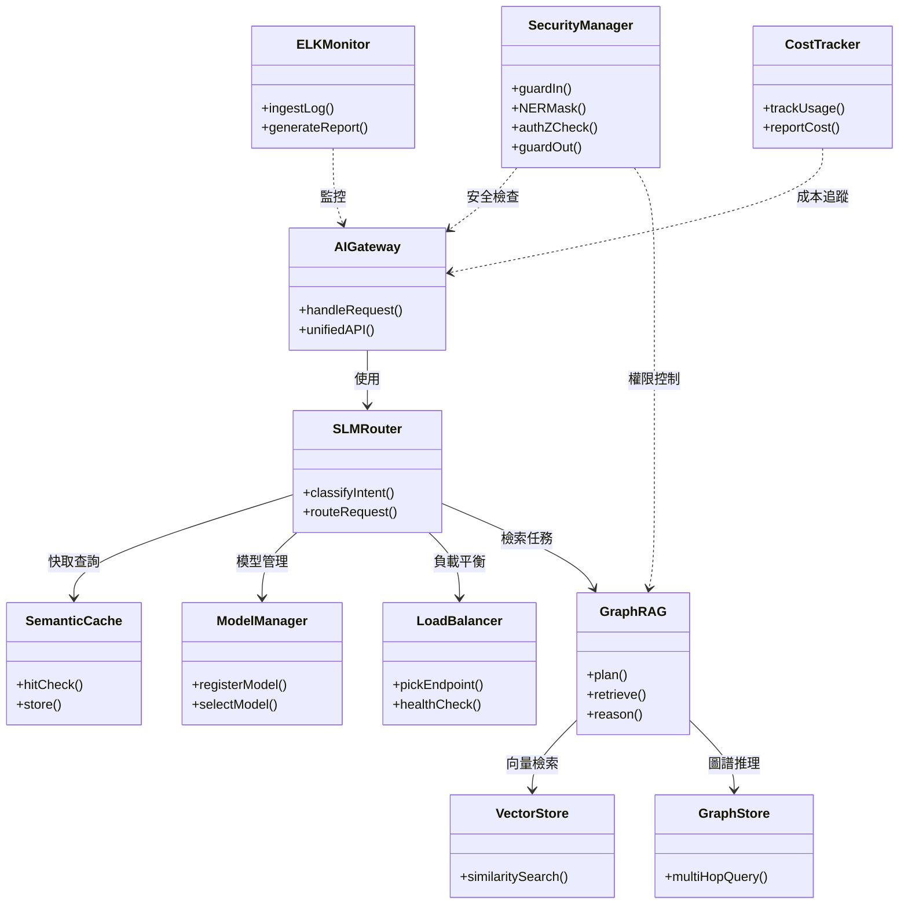

1. UML類別圖(Class Diagram)

```mermaid
classDiagram
    direction TB

    %% === 安全與治理層 ===
    class SecurityManager {
        +guardIn()
        +NERMask()
        +authZCheck()
        +guardOut()
    }

    class ELKMonitor {
        +ingestLog()
        +generateReport()
    }

    class CostTracker {
        +trackUsage()
        +reportCost()
    }

    %% === 對話協作層 ===
    class AIGateway {
        +handleRequest()
        +unifiedAPI()
    }

    class SLMRouter {
        +classifyIntent()
        +routeRequest()
    }

    class ModelManager {
        +registerModel()
        +selectModel()
    }

    class LoadBalancer {
        +pickEndpoint()
        +healthCheck()
    }

    class SemanticCache {
        +hitCheck()
        +store()
    }

    %% === 智慧檢索層 ===
    class GraphRAG {
        +plan()
        +retrieve()
        +reason()
    }

    class VectorStore {
        +similaritySearch()
    }

    class GraphStore {
        +multiHopQuery()
    }

    %% === 關聯層次 ===
    AIGateway --> SLMRouter : 使用
    SLMRouter --> SemanticCache : 快取查詢
    SLMRouter --> ModelManager : 模型管理
    SLMRouter --> LoadBalancer : 負載平衡
    SLMRouter --> GraphRAG : 檢索任務
    GraphRAG --> VectorStore : 向量檢索
    GraphRAG --> GraphStore : 圖譜推理

    %% === 跨層治理 ===
    SecurityManager ..> AIGateway : 安全檢查
    SecurityManager ..> GraphRAG : 權限控制
    ELKMonitor ..> AIGateway : 監控
    CostTracker ..> AIGateway : 成本追蹤
```
