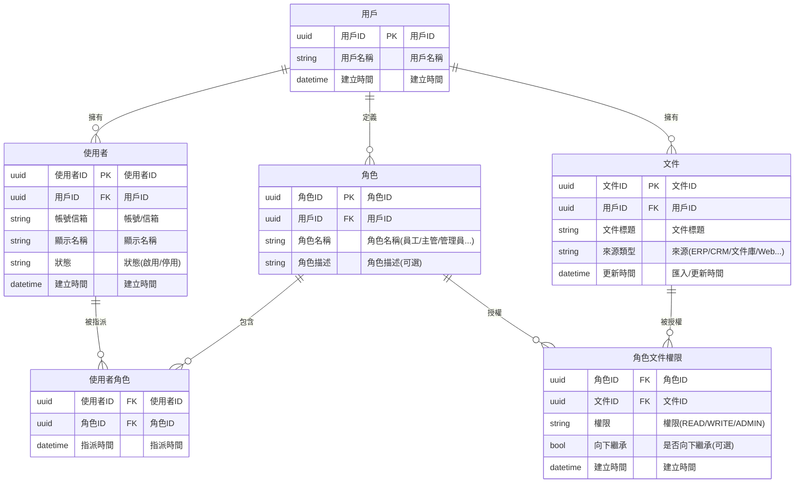

```mermaid
erDiagram
  用戶 ||--o{ 使用者 : "擁有"
  用戶 ||--o{ 角色 : "定義"
  使用者 ||--o{ 使用者角色 : "被指派"
  角色 ||--o{ 使用者角色 : "包含"

  用戶 ||--o{ 文件 : "擁有"
  角色 ||--o{ 角色文件權限 : "授權"
  文件 ||--o{ 角色文件權限 : "被授權"

  用戶 {
    uuid 用戶ID PK "用戶ID"
    string 用戶名稱 "用戶名稱"
    datetime 建立時間 "建立時間"
  }

  使用者 {
    uuid 使用者ID PK "使用者ID"
    uuid 用戶ID FK "用戶ID"
    string 帳號信箱 "帳號/信箱"
    string 顯示名稱 "顯示名稱"
    string 狀態 "狀態(啟用/停用)"
    datetime 建立時間 "建立時間"
  }

  角色 {
    uuid 角色ID PK "角色ID"
    uuid 用戶ID FK "用戶ID"
    string 角色名稱 "角色名稱(員工/主管/管理員...)"
    string 角色描述 "角色描述(可選)"
  }

  %% 組合實體 1：使用者 ↔ 角色 (多對多)
  使用者角色 {
    uuid 使用者ID FK "使用者ID"
    uuid 角色ID FK "角色ID"
    datetime 指派時間 "指派時間"
  }

  文件 {
    uuid 文件ID PK "文件ID"
    uuid 用戶ID FK "用戶ID"
    string 文件標題 "文件標題"
    string 來源類型 "來源(ERP/CRM/文件庫/Web...)"
    datetime 更新時間 "匯入/更新時間"
  }

  %% 組合實體 2：角色 ↔ 文件 (多對多) + 關係屬性(權限)
  角色文件權限 {
    uuid 角色ID FK "角色ID"
    uuid 文件ID FK "文件ID"
    string 權限 "權限(READ/WRITE/ADMIN)"
    bool 向下繼承 "是否向下繼承(可選)"
    datetime 建立時間 "建立時間"
  }
```
