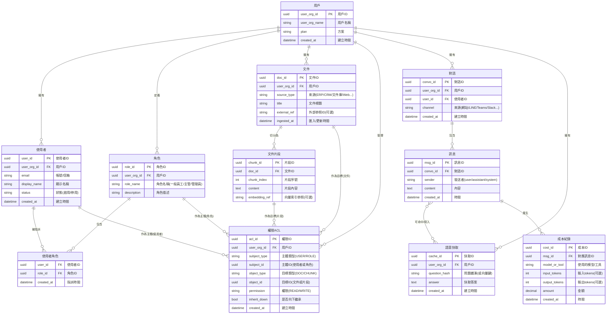
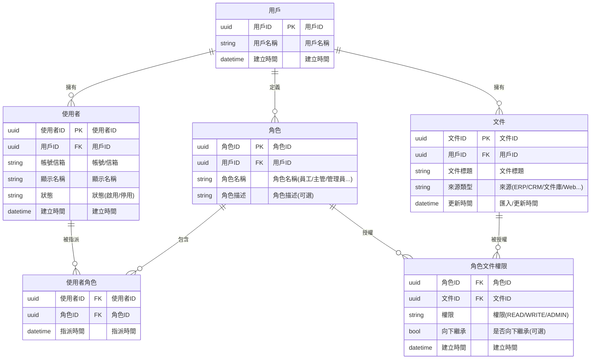

```mermaid
erDiagram
  用戶 ||--o{ 使用者 : "擁有"
  用戶 ||--o{ 角色 : "定義"
  使用者 ||--o{ 使用者角色 : "被指派"
  角色 ||--o{ 使用者角色 : "包含"

  用戶 ||--o{ 文件 : "擁有"
  文件 ||--o{ 文件片段 : "切分為"

  用戶 ||--o{ 權限ACL : "管理"
  使用者 ||--o{ 權限ACL : "作為主體(使用者)"
  角色 ||--o{ 權限ACL : "作為主體(角色)"
  文件 ||--o{ 權限ACL : "作為目標(文件)"
  文件片段 ||--o{ 權限ACL : "作為目標(片段)"

  用戶 ||--o{ 對話 : "擁有"
  對話 ||--o{ 訊息 : "包含"

  用戶 ||--o{ 語意快取 : "擁有"
  訊息 }o--o{ 語意快取 : "可命中/寫入"

  訊息 ||--o{ 成本紀錄 : "產生"

  用戶 {
    uuid user_org_id PK "用戶ID"
    string user_org_name "用戶名稱"
    string plan "方案"
    datetime created_at "建立時間"
  }

  使用者 {
    uuid user_id PK "使用者ID"
    uuid user_org_id FK "用戶ID"
    string email "帳號/信箱"
    string display_name "顯示名稱"
    string status "狀態(啟用/停用)"
    datetime created_at "建立時間"
  }

  角色 {
    uuid role_id PK "角色ID"
    uuid user_org_id FK "用戶ID"
    string role_name "角色名稱(一般員工/主管/管理員)"
    string description "角色描述"
  }

  使用者角色 {
    uuid user_id FK "使用者ID"
    uuid role_id FK "角色ID"
    datetime created_at "指派時間"
  }

  文件 {
    uuid doc_id PK "文件ID"
    uuid user_org_id FK "用戶ID"
    string source_type "來源(ERP/CRM/文件庫/Web...)"
    string title "文件標題"
    string external_ref "外部參照ID(可選)"
    datetime ingested_at "匯入/更新時間"
  }

  文件片段 {
    uuid chunk_id PK "片段ID"
    uuid doc_id FK "文件ID"
    int chunk_index "片段序號"
    text content "片段內容"
    string embedding_ref "向量索引參照(可選)"
  }

  權限ACL {
    uuid acl_id PK "權限ID"
    uuid user_org_id FK "用戶ID"
    string subject_type "主體類型(USER/ROLE)"
    uuid subject_id "主體ID(使用者或角色)"
    string object_type "目標類型(DOC/CHUNK)"
    uuid object_id "目標ID(文件或片段)"
    string permission "權限(READ/WRITE)"
    bool inherit_down "是否向下繼承"
    datetime created_at "建立時間"
  }

  對話 {
    uuid convo_id PK "對話ID"
    uuid user_org_id FK "用戶ID"
    uuid user_id FK "使用者ID"
    string channel "來源(網站/LINE/Teams/Slack...)"
    datetime created_at "建立時間"
  }

  訊息 {
    uuid msg_id PK "訊息ID"
    uuid convo_id FK "對話ID"
    string sender "發送者(user/assistant/system)"
    text content "內容"
    datetime created_at "時間"
  }

  語意快取 {
    uuid cache_id PK "快取ID"
    uuid user_org_id FK "用戶ID"
    string question_hash "問題雜湊(或向量鍵)"
    text answer "快取答案"
    datetime created_at "建立時間"
  }

  成本紀錄 {
    uuid cost_id PK "成本ID"
    uuid msg_id FK "對應訊息ID"
    string model_or_tool "使用的模型/工具"
    int input_tokens "輸入tokens(可選)"
    int output_tokens "輸出tokens(可選)"
    decimal amount "金額"
    datetime created_at "時間"
  }

```

```mermaid
erDiagram
  用戶 ||--o{ 使用者 : "擁有"
  用戶 ||--o{ 角色 : "定義"
  使用者 ||--o{ 使用者角色 : "被指派"
  角色 ||--o{ 使用者角色 : "包含"

  用戶 ||--o{ 文件 : "擁有"
  角色 ||--o{ 角色文件權限 : "授權"
  文件 ||--o{ 角色文件權限 : "被授權"

  用戶 {
    uuid 用戶ID PK "用戶ID"
    string 用戶名稱 "用戶名稱"
    datetime 建立時間 "建立時間"
  }

  使用者 {
    uuid 使用者ID PK "使用者ID"
    uuid 用戶ID FK "用戶ID"
    string 帳號信箱 "帳號/信箱"
    string 顯示名稱 "顯示名稱"
    string 狀態 "狀態(啟用/停用)"
    datetime 建立時間 "建立時間"
  }

  角色 {
    uuid 角色ID PK "角色ID"
    uuid 用戶ID FK "用戶ID"
    string 角色名稱 "角色名稱(員工/主管/管理員...)"
    string 角色描述 "角色描述(可選)"
  }

  %% 組合實體 1：使用者 ↔ 角色 (多對多)
  使用者角色 {
    uuid 使用者ID FK "使用者ID"
    uuid 角色ID FK "角色ID"
    datetime 指派時間 "指派時間"
  }

  文件 {
    uuid 文件ID PK "文件ID"
    uuid 用戶ID FK "用戶ID"
    string 文件標題 "文件標題"
    string 來源類型 "來源(ERP/CRM/文件庫/Web...)"
    datetime 更新時間 "匯入/更新時間"
  }

  %% 組合實體 2：角色 ↔ 文件 (多對多) + 關係屬性(權限)
  角色文件權限 {
    uuid 角色ID FK "角色ID"
    uuid 文件ID FK "文件ID"
    string 權限 "權限(READ/WRITE/ADMIN)"
    bool 向下繼承 "是否向下繼承(可選)"
    datetime 建立時間 "建立時間"
  }
```
