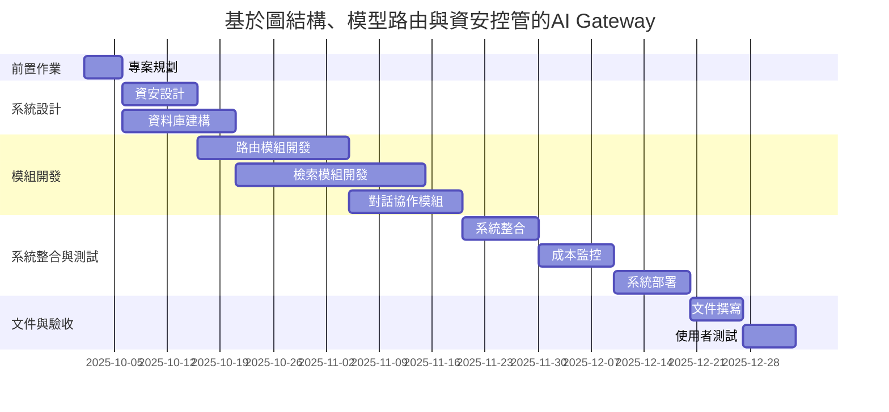
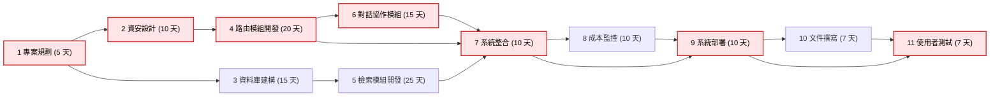

## 1.組員任務

| 組員         | 學號       | 任務                        |
| ------------ | ---------- | --------------------------- |
| 鍾昌錦(組長) | C112118111 | LLM、LLM 護欄、AI Agent、自然語言處理、系統開發|
| 戴暐翔       | C111161107 | 資料庫、向量資料庫、關聯式資料庫、ELK|
| 張竣霖       | C112118110 | 平台開發、對話流程管理、多AI代理管理|
| 黃俊霖       | C112118113 | 資安、RAG、GraphRAG、NER脫敏、系統測試|

## 2.專案時程總覽

| 任務 ID | 任務名稱     | 前置任務 | 工期（天） |  開始日期  |  結束日期  |
| :-----: | :----------- | :------: | :--------: | :--------: | :--------: |
|    1    | 專案規劃     |    —     |     5      | 2025-10-01 | 2025-10-05 |
|    2    | 資安設計     |    1     |     10     | 2025-10-06 | 2025-10-15 |
|    3    | 資料庫建構   |    1     |     15     | 2025-10-06 | 2025-10-20 |
|    4    | 路由模組開發 |    2     |     20     | 2025-10-16 | 2025-11-04 |
|    5    | 檢索模組開發 |    3     |     25     | 2025-10-21 | 2025-11-14 |
|    6    | 對話協作模組 |    4     |     15     | 2025-11-05 | 2025-11-19 |
|    7    | 系統整合     |  4,5,6   |     10     | 2025-11-15 | 2025-11-24 |
|    8    | 成本監控     |    7     |     10     | 2025-11-25 | 2025-12-04 |
|    9    | 系統部署     |   7,8    |     10     | 2025-12-05 | 2025-12-14 |
|   10    | 文件撰寫     |    9     |     7      | 2025-12-10 | 2025-12-17 |
|   11    | 使用者測試   |   9,10   |     7      | 2025-12-15 | 2025-12-21 |

## 3.甘特圖

## 4.PERT/CPM 圖

